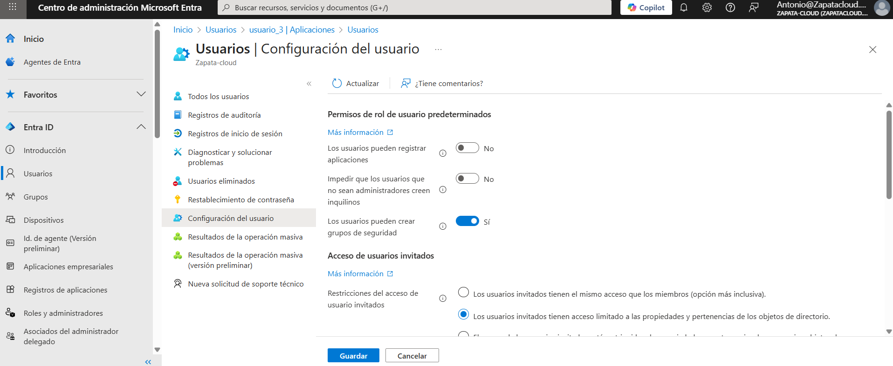
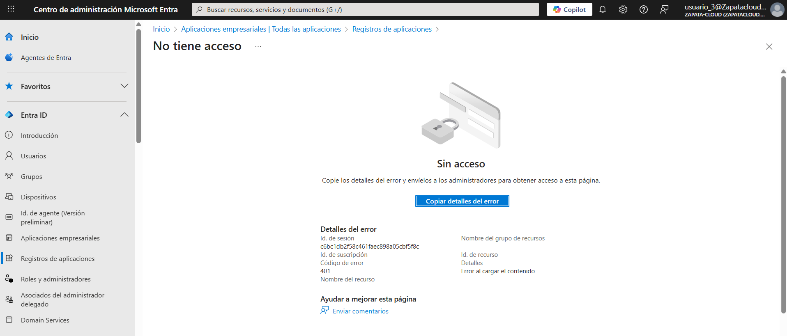
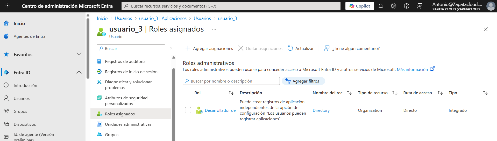

# Lab 03: Hardening del Tenant - Control de App Registrations

## 🎯 Objetivo
Prevenir Shadow IT evitando que usuarios no autorizados registren aplicaciones (App Registrations) que puedan solicitar permisos sensibles.

## 🛠️ Tareas realizadas
### Parte A — Bloqueo global (tenant-wide)
1. Bloqueo del registro de aplicaciones a nivel tenant: **Users can register applications = No**.
2. Validación con `usuario_3` (usuario estándar sin roles) intentando registrar una app.

### Parte B — Extensión: Excepción controlada (granular)
3. Asignación de rol mínimo a `usuario_3` para permitir registro de apps solo a usuarios autorizados.
4. Validación de que `usuario_3` pasa de **no poder** a **poder** iniciar un **New registration** en *App registrations* manteniendo el bloqueo global.

> Nota: Este laboratorio se centra en **App registrations** (registro de apps). La sección **Enterprise applications** se gestiona en otros escenarios (acceso/SSO/asignaciones), no es el foco de este lab.

## 📸 Evidencias
### Parte A — Bloqueo global
**Setting desactivado:**  
 

**Intento fallido con `usuario_3`:**  
 

### Parte B — Excepción controlada
**Rol asignado a `usuario_3`:**  

 

**Registro permitido tras la asignación:**  

 

## ✅ Checklist de verificación
### Parte A — Bloqueo global
- [x] Usuarios estándar no pueden registrar apps

### Parte B — Excepción controlada
- [x] `usuario_3` no puede registrar apps sin rol
- [x] `usuario_3` puede registrar apps tras asignarle el rol mínimo
- [x] El tenant mantiene el registro global bloqueado (control centralizado)

## 🗣️ Qué le diría al cliente / entrevista
“Bloqueo el registro de aplicaciones a nivel tenant para evitar Shadow IT y reducir el riesgo de exfiltración. Cuando hace falta, abro excepciones controladas solo para usuarios autorizados aplicando mínimo privilegio, manteniendo gobierno y trazabilidad.”
