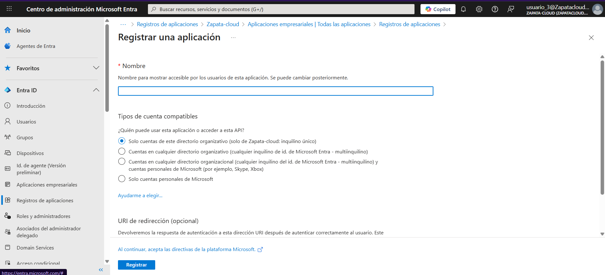

# Lab 03 — Hardening del Tenant: Control de App Registrations (Microsoft Entra ID)

## Contexto (por qué lo hice)
Un origen común de **Shadow IT** es permitir que cualquier usuario registre aplicaciones en el tenant.  
Eso puede derivar en apps que pidan permisos sensibles y aumenten superficie de ataque. En este lab aplico un control **tenant-wide** y, cuando es necesario, una excepción **controlada** con mínimo privilegio.

## Objetivo
Evitar que usuarios no autorizados registren aplicaciones (**App registrations**) y permitirlo solo a perfiles autorizados bajo **mínimo privilegio**.

> Nota: este lab se centra en **App registrations** (registro de apps). **Enterprise applications** se usa para SSO/asignaciones/acceso y no es el foco aquí.

---

## Tareas realizadas

### Parte A — Bloqueo global
1. Configuración tenant: **Users can register applications = No**
2. Validación con `usuario_3` (usuario estándar) intentando registrar una app.

### Parte B — Excepción controlada (granular)
3. Asignación de **rol mínimo** a `usuario_3` para permitir registro de apps solo a usuarios autorizados.
4. Validación: `usuario_3` pasa de **no poder** a **poder** iniciar un **New registration** manteniendo el bloqueo global.

---

## Evidencias

### Parte A — Bloqueo global
**Setting desactivado (Users can register applications = No):**  

**Intento fallido con `usuario_3` (sin permisos):**  

### Parte B — Excepción controlada
**Rol mínimo asignado a `usuario_3`:**  

**Registro permitido tras la asignación (New registration):**  

---

## Checklist de verificación
### Parte A — Bloqueo global
- [x] Usuarios estándar no pueden registrar apps

### Parte B — Excepción controlada
- [x] `usuario_3` no puede registrar apps sin rol
- [x] `usuario_3` puede registrar apps tras asignarle el rol mínimo
- [x] El tenant mantiene el registro global bloqueado (control centralizado)

---

## Qué explicaría en una entrevista / a un cliente
“Bloqueo el registro de aplicaciones a nivel tenant para reducir Shadow IT y limitar la exposición a apps que soliciten permisos sensibles.  
Si el negocio necesita registrar apps, abro una excepción controlada asignando el **rol mínimo** solo a usuarios autorizados, manteniendo gobierno, trazabilidad y mínimo privilegio.”
